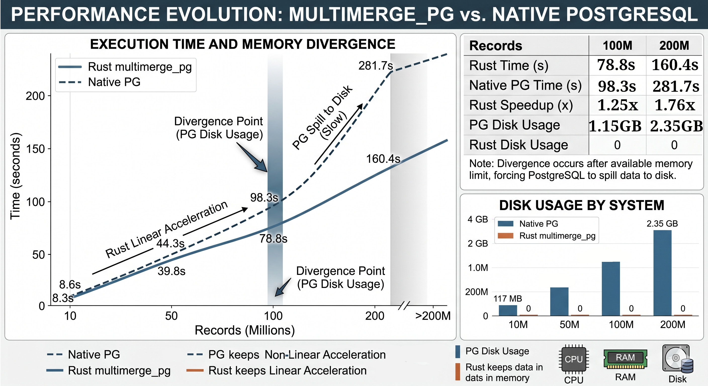

# multimerge_pg

**multimerge_pg** is a high-performance, parallel sorting engine built in Rust for PostgreSQL. It was designed to bypass the physical and architectural limitations of the standard PostgreSQL `ORDER BY` clause when handling massive datasets that exceed the `work_mem` limit.

While PostgreSQL is a masterpiece of relational engineering, its standard External Merge Sort becomes I/O-bound as datasets grow. **multimerge_pg** solves this by leveraging **Multithreading**, **Binary Vectorization**, and **Arena Allocation** to keep data strictly within RAM, preserving hardware longevity and slashing execution costs in cloud environments.

---

# 🔗 Core Algorithm & Academic Background

> 📌 **Note:** The mathematical foundations, dynamic heuristics, and exhaustive standalone benchmarks of the Multimerge engine are fully detailed and tested in the primary repository.

> 👉 **[Core Multimerge Sorting Repository](https://github.com/fbcouto/adaptive-parallel-multimerge-sort)**

The core theoretical foundation of this parallel architecture is based on the original research and paper:

- **Title:** *Multimerge*
- **Authors:** Fernando B. Couto & Fábio S. Couto
- **Conference:** PDPTA'11 — The 2011 International Conference on Parallel and Distributed Processing Techniques and Applications
- **Lecture Series:** WorldComp'11 (The 2011 World Congress in Computer Science, Computer Engineering, and Applied Computing)
- The architecture implements a hybrid processing model based on the original **Multimerge** paper published in **PDPTA'11**.

It modernizes those multi-merge paradigms by utilizing runtime entropy sampling (**Adaptive Oscillation Heuristic**) and Rayon's work-stealing parallel scheduler.

---

# 🗺️ Engineering Roadmap

The project evolved through critical stages of performance optimization:

1. **Binary Vectorization**  
   Bypassed row-based SQL processing using `COPY BINARY` streams and `BufReader`, eliminating row-processing overhead.

2. **Parallelism (Rayon)**  
   Implemented a work-stealing parallel merge sort to saturate all physical CPU cores.

3. **Memory Management (Bumpalo)**  
   Integrated an Arena Allocator to eliminate Heap fragmentation and expensive OS-level allocations for dynamic text data.

4. **Pointer Sorting**  
   Shifted from moving heavy data structures to sorting 8-byte references (`&str`), maximizing CPU cache efficiency.

---

# 📊 Performance Benchmark (Integers)
<p align="center">
  
</p>

The following table summarizes the performance of **multimerge_pg** against the native PostgreSQL engine. Note the divergence as the dataset size exceeds available memory, forcing PostgreSQL to spill data to disk.

| Records | Rust Time | PG Native | Rust Speedup | PG Disk Usage | Rust Disk Usage |
|---|---|---|---|---|---|
| 10 Million | 8.3s | 8.6s | 1.03x | 117 MB | 0 |
| 50 Million | 39.8s | 44.3s | 1.11x | 587 MB | 0 |
| 100 Million | 78.8s | 98.3s | 1.25x | 1.15 GB | 0 |
| 200 Million | 160.4s | 281.7s | 1.76x | 2.35 GB | 0 |

---

# 🚀 Technical Deep Dive

## 1. Memory Management: The "Arena" Advantage

When processing millions of strings or dynamic data, the standard `String` allocation in Rust (and most C engines) causes severe Heap fragmentation.

By using `bumpalo` (Arena Allocation), we treat memory as a contiguous block. Instead of asking the Operating System for memory 50 million times, we request one large block (e.g., 512MB) and simply "bump" a pointer forward for each new entry. This eliminates overhead and ensures the CPU's L1/L2 caches are constantly fed with contiguous data, drastically increasing performance.

---

## 2. The "Marshalling Tax"

You might notice that in some benchmarks, our engine is only slightly faster or, in the case of complex string marshalling, roughly on par with PostgreSQL.

The reason is the FFI (Foreign Function Interface) Boundary. PostgreSQL natively keeps data in its own optimized C structures. To return data from Rust to PostgreSQL, we must "re-package" (serialize) our sorted results into the format the database expects.

The heavy lifting (the sorting and memory management) is performed significantly faster in Rust, but the final step of handing the data back to PostgreSQL incurs a **"Marshalling Tax."**

---

## 3. Impact on Infrastructure and Cloud Costs

The performance metrics above tell only half the story. The real value is in **Total Cost of Ownership (TCO):**

- **Hardware Longevity:** PostgreSQL's external merge writes over 2GB of temporary data to disk for 200M records. Constantly writing to SSDs degrades their TBW (Total Bytes Written) rating. Our engine performs **0 writes to disk** during the sorting process.

- **Cloud IOPS Costs:** In cloud environments (AWS RDS/EBS), you pay for IOPS. By keeping processing within RAM, **multimerge_pg** avoids the IOPS throttles and extra costs associated with spilling to disk, ensuring predictable latency (P99) and lower monthly bills.

---

# 🛠️ How to Reproduce

## Prerequisites

- Rust/Cargo installed.
- `pgrx` installed and configured.
- PostgreSQL 17 (or compatible).

---

## Steps

### 1. Clone the repository

```bash
git clone [repository-url]
cd multimerge_pg
```

### 2. Enable Arena Support

Ensure your `Cargo.toml` has the `collections` feature enabled for `bumpalo`:

```toml
[dependencies]
bumpalo = { version = "3.16", features = ["collections"] }
```

### 3. Build and Run

```bash
cargo pgrx run --release --features pg17
```

### 4. Benchmarking

Inside `psql`, initialize the extension and run the test suite:

```sql
CREATE EXTENSION multimerge_pg;

\timing on

-- Run the integer sort test
SELECT count(*) FROM pg_multimerge_binary_copy(
    'SELECT (random() * 1000000)::integer FROM generate_series(1, 200000000)',
    'C:/Users/Public/pg_batch.bin'
);
```

---

# 🧠 Final Notes

This engine stands as a reference case: with Rust, we can push PostgreSQL beyond the theoretical limits of its traditional architecture.

---

# 📜 License

This project is licensed under the Apache License, Version 2.0.
